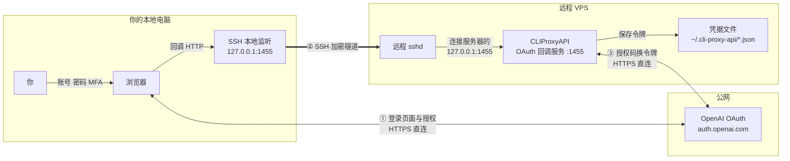
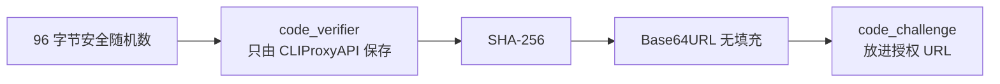
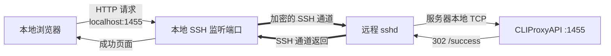
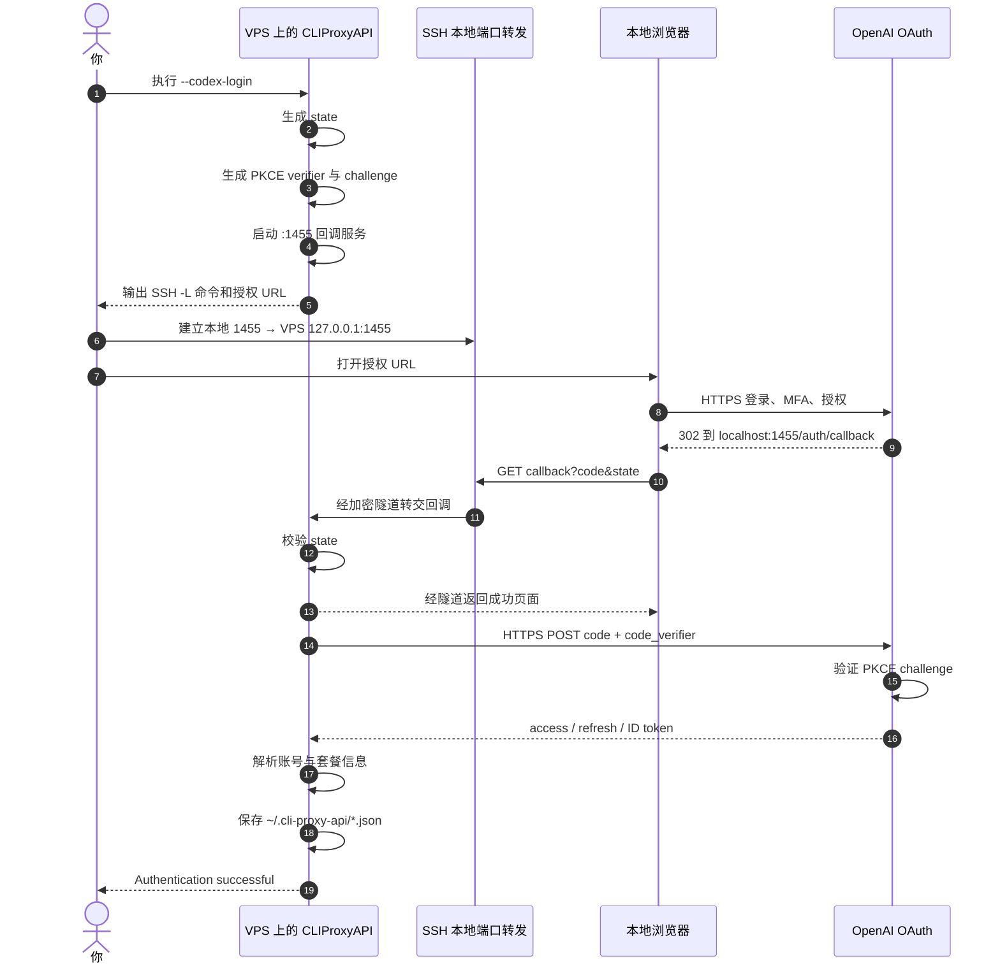

# 一台没有浏览器的服务器，如何完成 Codex OAuth 登录？

> **CLIProxyAPI 7.2.28 远程认证流程图解**  
> 基于实际终端日志，以及 `router-for-me/CLIProxyAPI` 的 `5d9ea166` 源码分析。

---

## 先说结论：真正巧妙的地方是什么？

服务器虽然没有浏览器，但它可以临时启动一个 **OAuth 回调接收器**；你的本地电脑虽然没有运行 CLIProxyAPI，却有浏览器，而且能够通过 **SSH 本地端口转发**，把浏览器访问的：

```text
http://localhost:1455/auth/callback
```

悄悄送到服务器上的 CLIProxyAPI。

换句话说：

> **浏览器负责让“人”登录，服务器负责保存并使用令牌，SSH 隧道负责把二者接起来。**

而且登录密码、MFA、浏览器 Cookie 都只出现在你本地浏览器与 OpenAI 的 HTTPS 页面之间，不会交给 CLIProxyAPI。

---

## 1. 整个系统里有哪些参与者？

| 参与者 | 所在位置 | 负责什么 |
|---|---|---|
| 你 | 本地电脑前 | 输入账号、密码、MFA，并授权登录 |
| 本地浏览器 | 本地电脑 | 打开 OpenAI 登录页，最后访问 `localhost:1455` |
| 本地 SSH 客户端 | 本地电脑 | 监听本地 1455 端口，把连接转发到服务器 |
| 远程 `sshd` | VPS | 接收加密隧道中的数据，并连接服务器自己的 `127.0.0.1:1455` |
| CLIProxyAPI | VPS | 生成 PKCE、启动回调 HTTP 服务、接收授权码、兑换令牌、保存凭据 |
| OpenAI 认证服务 | 公网 | 展示登录 UI、验证账号、签发授权码和 OAuth 令牌 |

---

## 2. 一张图看懂三个网络路径



这里非常容易产生一个误解：**登录页面本身并没有穿过 SSH 隧道。**

实际上有三条独立路径：

1. **浏览器 ↔ OpenAI**：本地浏览器通过 HTTPS 直接登录 OpenAI。
2. **浏览器 → CLIProxyAPI**：只有最后的 localhost 回调经过 SSH 隧道。
3. **CLIProxyAPI ↔ OpenAI**：服务器拿到授权码后，通过 HTTPS 直接兑换令牌。

---

## 3. 为什么 URL 写的是 `localhost`，却能回到远程服务器？

这是整个设计里最“像魔术”的地方。

OAuth URL 中的回调地址是：

```text
redirect_uri=http://localhost:1455/auth/callback
```

`localhost` 永远是一个**相对概念**：它指的是“当前发起连接的那台机器”。

回调是由你的**本地浏览器**发起的，所以浏览器理解的 `localhost` 是：

```text
你的本地电脑
```

而不是远程 VPS。

如果不做任何处理，本地浏览器访问 `localhost:1455` 时，只会寻找你电脑上的 1455 端口，当然找不到 VPS 上的 CLIProxyAPI。

SSH `-L` 做的事，就是在本地创建一个“假入口”：

```text
浏览器以为：我正在访问本机 1455
实际发生：本机 1455 → SSH 隧道 → VPS 的 127.0.0.1:1455
```

### `localhost` 的视角差异

| 代码或程序所在位置 | `localhost:1455` 指向哪里？ |
|---|---|
| 你的本地浏览器 | 你的电脑的 1455 端口 |
| VPS 上的 CLIProxyAPI | VPS 自己的 1455 端口 |
| SSH 命令中 `-L` 的目标端 | 由远程 `sshd` 去访问 VPS 的 `127.0.0.1:1455` |

---

## 4. 逐段拆解 SSH 端口转发命令

CLIProxyAPI 打印的命令类似：

```bash
ssh -L 1455:127.0.0.1:1455 root@<server-ip> -p 22
```

它可以拆成：

```text
ssh
 ├─ -L 1455:127.0.0.1:1455
 │    │       │           └─ 远程目标端口
 │    │       └──────────── 远程服务器眼中的目标地址
 │    └──────────────────── 本地监听端口
 ├─ root@<server-ip>         SSH 登录目标
 └─ -p 22                    SSH 服务端口
```

更准确地说：

```text
-L [本地绑定地址:]本地端口:远程侧目标主机:远程侧目标端口
```

因此：

```text
-L 1455:127.0.0.1:1455
```

表示：

> 在本地监听 1455；收到连接后，通过 SSH 送到 VPS，再由 VPS 连接它自己的 `127.0.0.1:1455`。

### 更稳妥的推荐写法

```bash
ssh \
  -N \
  -T \
  -o ExitOnForwardFailure=yes \
  -L 127.0.0.1:1455:127.0.0.1:1455 \
  root@<server-ip> \
  -p 22
```

| 参数 | 作用 |
|---|---|
| `-N` | 不执行远程 shell 命令，只建立转发 |
| `-T` | 不分配伪终端 |
| `ExitOnForwardFailure=yes` | 如果端口转发建立失败，立即退出，不制造“隧道似乎成功”的错觉 |
| `-L 127.0.0.1:...` | 明确只让本机访问这个临时监听端口 |

> 如果你还要在同一个 SSH 会话里操作远程终端，可以不使用 `-N -T`，保留原命令即可。

---

## 5. 从执行命令开始，CLIProxyAPI 做了什么？

你执行：

```bash
./cli-proxy-api --codex-login
```

CLIProxyAPI 随后依次做了这些事：

### 第一步：生成一对 PKCE 密钥材料

程序在内存里生成：

```text
code_verifier   = 高强度随机字符串，只留在 CLIProxyAPI 进程里
code_challenge  = BASE64URL(SHA256(code_verifier))
```

源码中使用 96 个加密安全随机字节生成 `code_verifier`，再用 SHA-256 计算 `code_challenge`。



PKCE 的意义是：即使有人截获了最后的 `code` 授权码，也没有服务器内存里的 `code_verifier`，因此通常不能兑换令牌。

---

### 第二步：生成随机 `state`

CLIProxyAPI 另外生成 16 个随机字节，并编码成 32 位十六进制字符串：

```text
state=<一次性随机值>
```

它把这个值放进授权 URL，回调回来后必须完全一致。

其作用主要是防止：

- 攻击者伪造回调；
- 把另一场登录的授权码塞进当前登录流程；
- OAuth 登录请求与回调发生串线。

可以把它理解成这次登录的“取件号码”。

---

### 第三步：服务器启动一个临时 HTTP 回调服务

CLIProxyAPI 在服务器上启动：

```text
/auth/callback  接收 code、state 或 error
/success        显示登录成功页面
```

默认端口是：

```text
1455
```

它最多等待约 5 分钟，认证完成后会关闭这个临时 HTTP 服务。

> **源码细节提醒：**该版本实际使用 `Addr: ":1455"`，即监听所有网络接口，而不只是 `127.0.0.1`。后文会给出安全建议。

---

### 第四步：拼出 OpenAI 授权 URL

日志中的长 URL 大致包含这些参数：

| 参数 | 含义 |
|---|---|
| `client_id` | 标识 Codex/CLI 这个 OAuth 客户端；它不是用户密码 |
| `response_type=code` | 使用 Authorization Code 授权码流程 |
| `redirect_uri=http://localhost:1455/auth/callback` | 登录完成后让浏览器访问本机回调地址 |
| `scope=openid email profile offline_access` | 请求身份信息，并请求可用于续期的 refresh token |
| `state=...` | 本次登录的一次性随机关联值，用于防止伪造和串线 |
| `code_challenge=...` | 从 `code_verifier` 推导出的 PKCE 挑战值 |
| `code_challenge_method=S256` | 使用 SHA-256 的 PKCE 模式 |
| `prompt=login` | 要求展示登录流程 |
| `id_token_add_organizations=true` | 请求在身份信息中加入组织相关内容 |
| `codex_cli_simplified_flow=true` | Codex CLI 使用的简化登录流程标志 |

你可以公开看到 `client_id` 和 `code_challenge`，这并不等于泄露密码。真正关键的 `code_verifier` 留在服务器进程内存中，并未放进授权 URL。

---

### 第五步：发现服务器没有浏览器

CLIProxyAPI 尝试打开浏览器，发现这是无桌面的服务器，于是输出：

```text
No browser available; please open the URL manually
To authenticate from a remote machine, an SSH tunnel may be required.
```

这不表示认证失败，只表示：

> “我已经准备好了授权 URL 和回调服务，但需要你在另一台有浏览器的电脑上完成 UI 操作。”

---

### 第六步：本地浏览器完成真正的账号认证

你在本地打开授权 URL：

```text
本地浏览器 ──HTTPS──> auth.openai.com
```

账号密码、MFA 和 OpenAI 会话 Cookie 都发生在这条 HTTPS 连接中。

CLIProxyAPI 不会生成 OpenAI 登录 UI，也不需要在 VPS 上安装 Chrome。它只是把你送到官方认证页面，并等待结果。

---

### 第七步：OpenAI 把浏览器重定向到 localhost

登录完成后，OpenAI 返回一个重定向，概念上类似：

```http
HTTP/1.1 302 Found
Location: http://localhost:1455/auth/callback?code=<authorization-code>&state=<original-state>
```

浏览器随后访问：

```text
http://localhost:1455/auth/callback?code=...&state=...
```

此时 SSH 隧道开始发挥作用：



虽然浏览器地址栏仍然显示 `localhost`，真正处理请求的是 VPS 上的 CLIProxyAPI。

---

### 第八步：校验 `state`

CLIProxyAPI 从回调中提取：

```text
code
state
error（如果有）
```

然后检查：

```text
回调里的 state == 发起登录前保存在内存里的 state
```

不一致就拒绝继续。

---

### 第九步：服务器用授权码和 PKCE verifier 换取令牌

校验通过后，CLIProxyAPI 从 VPS 向 OpenAI 发起 HTTPS POST：

```text
POST https://auth.openai.com/oauth/token
```

核心参数包括：

```text
grant_type=authorization_code
client_id=<codex-client-id>
code=<authorization-code>
redirect_uri=http://localhost:1455/auth/callback
code_verifier=<只保存在服务器内存中的原始随机串>
```

OpenAI 会重新计算：

```text
BASE64URL(SHA256(code_verifier))
```

并检查它是否等于授权开始时收到的 `code_challenge`。

只有匹配，OpenAI 才会签发令牌。

---

### 第十步：保存令牌到服务器

响应通常包含：

| 字段 | 作用 |
|---|---|
| `access_token` | 调用相关服务时使用，通常有效期较短 |
| `refresh_token` | access token 过期后用于换取新令牌，应视为高敏感长期凭据 |
| `id_token` | 包含账号身份声明的 JWT，例如邮箱、账号或套餐相关信息 |
| `expires_in` | access token 的有效期 |

CLIProxyAPI 从 ID token 中提取邮箱、账号 ID、套餐类型等信息，然后生成类似以下文件名：

```text
codex-<account-email>-<plan>.json
```

默认保存目录是：

```text
~/.cli-proxy-api/
```

因此日志最终出现：

```text
Authentication saved to ~/.cli-proxy-api/codex-<account-email>-<plan>.json
Codex authentication successful!
```

---

## 6. 完整时序图



---

## 7. SSH、`state` 和 PKCE 分别保护什么？

这三个机制不是重复的，它们保护的是不同层面。

### 7.1 SSH：保护“回调运输通道”

SSH 负责：

- 验证你是否有权限登录 VPS；
- 加密本地与 VPS 之间的隧道流量；
- 把浏览器访问的本地 1455 转到 VPS 回调服务。

SSH **不负责**验证 OpenAI 账号，也不会替代 OAuth。

---

### 7.2 `state`：保护“这是不是我刚才发起的那次登录”

如果回调中的 `state` 不匹配，CLIProxyAPI 会拒绝它。

```text
正确回调：state = 本次登录生成的随机值  → 接受
伪造回调：state = 其他值                 → 拒绝
```

---

### 7.3 PKCE：保护“拿到 code 的人是否真的是发起登录的客户端”

```text
授权开始：只发送 challenge
令牌兑换：必须提交原始 verifier
```

攻击者即使看到：

```text
code + code_challenge
```

也很难反推出：

```text
code_verifier
```

因此不能只靠截获授权码完成令牌兑换。

---

## 8. 一个常见误解：服务器到底有没有“认证 UI”？

没有。

CLIProxyAPI 在 VPS 上临时提供的网页只有类似：

```text
Authentication successful
You may close this window
```

它不负责账号输入、密码验证或 MFA。

真正的登录 UI 来自：

```text
https://auth.openai.com/
```

所以整个系统把职责分得很清楚：

```text
OpenAI：认证用户身份
浏览器：展示 UI、承载人的操作
CLIProxyAPI：发起 OAuth、接收 code、兑换并保存 token
SSH：解决浏览器与远程回调服务不在同一台机器的问题
```

---

## 9. 日志里的手工粘贴提示是怎么回事？

源码中还有一个备用路径：等待约 15 秒后，CLIProxyAPI 会提示：

```text
Paste the Codex callback URL (or press Enter to keep waiting):
```

所以有两种完成回调的方法。

### 方法 A：SSH 隧道自动回调

```text
浏览器 localhost:1455
    → SSH 隧道
    → VPS CLIProxyAPI
```

这种情况下通常不需要复制任何 URL。

### 方法 B：手工粘贴回调 URL

如果没有隧道，浏览器最后访问 localhost 可能显示连接失败，但地址栏中已经带有：

```text
code=...
state=...
```

用户可以把**完整回调 URL**复制到 SSH 终端，CLIProxyAPI 会解析 URL、校验 `state`，然后继续换取令牌。

### 那次日志究竟走了哪一条？

仅凭下面这种连在一起的输出：

```text
Paste the Codex callback URL ...: Codex authentication successful
```

不能百分之百确定。

原因是 CLIProxyAPI 一边异步等待网络回调，一边显示手工输入提示：

- 如果你粘贴了 URL，则走方法 B；
- 如果隧道回调恰好在提示出现后到达，也可能是方法 A，只是异步输出看起来连在了一起。

---

## 10. 这套设计为什么适合无桌面服务器？

它巧妙地避开了以下需求：

- 不需要在 VPS 安装完整桌面环境；
- 不需要安装 Chrome 或 Firefox；
- 不需要把密码输入服务器终端；
- 不需要把 OAuth 登录页暴露成远程 Web UI；
- 不需要给 VPS 开放一个公网回调域名和 HTTPS 证书；
- 登录完成后，只保留服务器真正需要的令牌。

本质上，这是把一条原本只适用于“本机桌面应用”的 loopback OAuth 回调，通过 SSH 安全地延长到了远程服务器。

---

## 11. 安全边界与实用建议

### 11.1 凭据 JSON 是真正需要保护的秘密

以下内容都应视为敏感信息：

```text
access_token
refresh_token
id_token
完整 OAuth 回调 URL
```

尤其是 `refresh_token`，它通常可以持续换取新的 access token。

不要：

- 把凭据 JSON 提交到 Git；
- 把完整文件发到群聊、工单或公开日志；
- 把带有 `code` 的回调 URL 截图公开；
- 将 `~/.cli-proxy-api` 作为普通备份明文上传公共网盘。

---

### 11.2 收紧目录与文件权限

典型的目录权限是：

```text
drwx------ ~/.cli-proxy-api
```

这意味着目录只有属主能进入，是好的。

但凭据文件可能显示为：

```text
-rw-r--r-- *.json
```

虽然其他用户通常无法穿过 `0700` 的父目录读取文件，但令牌文件自身使用 `0600` 会更稳妥，能降低文件被移动、复制或父目录权限误改后的风险：

```bash
chmod 700 ~/.cli-proxy-api
chmod 600 ~/.cli-proxy-api/*.json
```

还可以检查：

```bash
stat -f '%Sp %N' ~/.cli-proxy-api ~/.cli-proxy-api/*.json 2>/dev/null \
  || stat -c '%A %a %n' ~/.cli-proxy-api ~/.cli-proxy-api/*.json
```

> 源码的通用文件存储路径有使用 `0600` 的分支，但该版本 Codex token storage 通过 `os.Create` 创建文件，最终权限会受到进程 `umask` 影响；实际日志中结果为 `0644`。

---

### 11.3 回调服务最好只监听服务器 loopback

当前分析版本在源码中使用：

```go
Addr: fmt.Sprintf(":%d", s.port)
```

这通常意味着监听所有接口，而不是仅监听服务器的 `127.0.0.1`。

虽然服务只短暂运行、`state` 与 PKCE 仍提供保护，但从最小暴露原则看，更理想的是：

```go
Addr: fmt.Sprintf("127.0.0.1:%d", s.port)
```

在不改代码的情况下，至少建议：

- 不要在云防火墙或系统防火墙中向公网开放 TCP 1455；
- 只通过 SSH 隧道访问它；
- 登录结束后确认临时监听已经关闭。

可以检查：

```bash
ss -lntp | grep ':1455'
```

认证结束后，正常情况下不应再看到 CLIProxyAPI 的临时 1455 监听。

---

### 11.4 推荐使用 SSH 密钥并限制 root 登录

如果示例使用：

```text
root@<server-ip>
```

生产环境更推荐：

- 使用专门的低权限服务账号运行 CLIProxyAPI；
- 使用 SSH 密钥而不是弱密码；
- 根据实际运维方式限制直接 root 登录；
- 对保存令牌的账号目录使用最小权限。

因为一旦攻击者获得运行 CLIProxyAPI 的系统账号权限，OAuth token 本身也可能被读取。

---

### 11.5 建立隧道时显式绑定本机 loopback

推荐：

```bash
-L 127.0.0.1:1455:127.0.0.1:1455
```

而不是把本地监听暴露到局域网或所有接口。

---

### 11.6 认证完成后关闭多余 SSH 隧道

认证已经完成并保存 token 后，这条临时转发通常不再需要。可以直接结束只用于转发的 SSH 进程。

---

## 12. 哪些数据去了哪里？

| 数据 | 本地浏览器可见 | SSH 隧道经过 | VPS CLIProxyAPI 可见 | OpenAI 可见 |
|---|:---:|:---:|:---:|:---:|
| 账号、密码、MFA | ✅ | ❌ | ❌ | ✅ |
| OpenAI 浏览器 Cookie | ✅ | ❌ | ❌ | ✅ |
| `state` | ✅ URL 中可见 | ✅ 回调时 | ✅ | ✅ |
| `code_challenge` | ✅ 授权 URL 中 | ❌ 通常不经隧道 | ✅ 生成者 | ✅ |
| `code_verifier` | ❌ | ❌ | ✅ 仅进程内存 | ✅ 兑换时 |
| authorization code | ✅ 回调 URL 中 | ✅ 自动回调时 | ✅ | ✅ |
| access / refresh token | ❌ | ❌ | ✅ | ✅ |

这张表解释了一个重要事实：

> **VPS 没有看到你的密码，但最终拿到了可以代表账号访问服务的 OAuth token。**

这正是 OAuth 的目标——不给应用密码，只给它权限受限、可过期、可刷新或可撤销的令牌。

---

## 13. 用一句生活化的比喻总结

可以把它想象成：

1. VPS 上的 CLIProxyAPI 生成一张带防伪暗号的“取件单”；
2. 你在本地浏览器去 OpenAI 柜台出示身份并授权；
3. OpenAI 把一次性“取件码”送到你电脑的 `localhost:1455`；
4. SSH 隧道像一根加密气动管道，把取件码送到 VPS；
5. VPS 再拿“取件码 + 只有自己知道的 PKCE 暗号”去兑换正式令牌；
6. 令牌保存在 VPS，之后 API 服务无需重复打开浏览器。

浏览器解决“人如何登录”，OAuth 解决“服务如何获得授权”，PKCE 与 `state` 解决“如何防止码被冒领”，SSH 解决“回调端和浏览器不在一台机器上”。

---

## 14. 源码对应关系

本文按以下版本进行分析：

```text
CLIProxyAPI 7.2.28
Commit: 5d9ea1667b8b5b2185f8011b4f7a91d5dd58a0bf
BuiltAt: 2026-06-22T14:43:11Z
```

关键实现位置：

| 功能 | 源码 |
|---|---|
| Codex 登录总流程、启动回调、等待自动或手工回调、校验 state | [`sdk/auth/codex.go`](https://github.com/router-for-me/CLIProxyAPI/blob/5d9ea1667b8b5b2185f8011b4f7a91d5dd58a0bf/sdk/auth/codex.go) |
| PKCE 生成 | [`internal/auth/codex/pkce.go`](https://github.com/router-for-me/CLIProxyAPI/blob/5d9ea1667b8b5b2185f8011b4f7a91d5dd58a0bf/internal/auth/codex/pkce.go) |
| 授权 URL、授权码换 token、refresh token 续期 | [`internal/auth/codex/openai_auth.go`](https://github.com/router-for-me/CLIProxyAPI/blob/5d9ea1667b8b5b2185f8011b4f7a91d5dd58a0bf/internal/auth/codex/openai_auth.go) |
| 临时 HTTP 回调服务器 | [`internal/auth/codex/oauth_server.go`](https://github.com/router-for-me/CLIProxyAPI/blob/5d9ea1667b8b5b2185f8011b4f7a91d5dd58a0bf/internal/auth/codex/oauth_server.go) |
| `state` 生成、手工回调 URL 解析 | [`internal/misc/oauth.go`](https://github.com/router-for-me/CLIProxyAPI/blob/5d9ea1667b8b5b2185f8011b4f7a91d5dd58a0bf/internal/misc/oauth.go) |
| SSH 隧道提示文字 | [`internal/util/ssh_helper.go`](https://github.com/router-for-me/CLIProxyAPI/blob/5d9ea1667b8b5b2185f8011b4f7a91d5dd58a0bf/internal/util/ssh_helper.go) |
| Codex token JSON 结构与文件保存 | [`internal/auth/codex/token.go`](https://github.com/router-for-me/CLIProxyAPI/blob/5d9ea1667b8b5b2185f8011b4f7a91d5dd58a0bf/internal/auth/codex/token.go) |
| 凭据文件名生成 | [`internal/auth/codex/filename.go`](https://github.com/router-for-me/CLIProxyAPI/blob/5d9ea1667b8b5b2185f8011b4f7a91d5dd58a0bf/internal/auth/codex/filename.go) |
| 命令入口与成功输出 | [`internal/cmd/openai_login.go`](https://github.com/router-for-me/CLIProxyAPI/blob/5d9ea1667b8b5b2185f8011b4f7a91d5dd58a0bf/internal/cmd/openai_login.go) |

---

## 15. 标准与参考资料

- [CLIProxyAPI 官方仓库](https://github.com/router-for-me/CLIProxyAPI)
- [本次分析对应的精确提交 `5d9ea166`](https://github.com/router-for-me/CLIProxyAPI/commit/5d9ea1667b8b5b2185f8011b4f7a91d5dd58a0bf)
- [RFC 7636：OAuth 2.0 PKCE](https://www.rfc-editor.org/rfc/rfc7636)
- [RFC 6749：OAuth 2.0 Authorization Framework](https://www.rfc-editor.org/rfc/rfc6749)
- [RFC 8252：OAuth 2.0 for Native Apps 与 loopback redirect](https://datatracker.ietf.org/doc/html/rfc8252)
- [RFC 9700：OAuth 2.0 Security Best Current Practice](https://www.rfc-editor.org/rfc/rfc9700.html)
- [OpenSSH `ssh(1)`：`-L` 本地端口转发](https://man.openbsd.org/ssh)

---

> **隐私说明：**本文主动将日志中的服务器 IP、账号邮箱、授权随机值等替换为占位符。OAuth 回调 URL、token 文件内容及账号标识不应出现在公开文档中。
